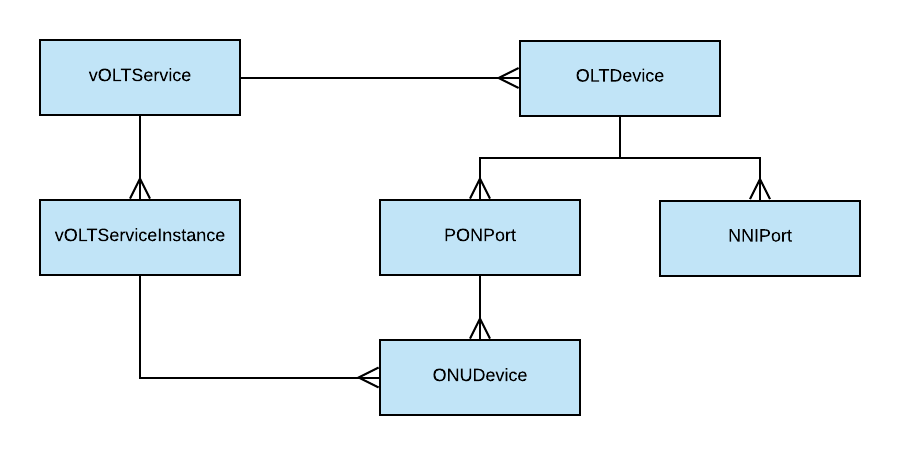

# vOLT Service

The `vOLTService` is responsible to configure the access network in RCORD and it
does that leveraging `VOLTHA`.

## vOLT Modeling

Here is an image describing the models that compose this service,
followed by a brief description of any of them.
For a full reference on these models, please take a look at their
[xProto](https://github.com/opencord/olt-service/blob/master/xos/synchronizer/models/volt.xproto)
representation.



**vOLTService**

Contains the information that the synchronizer needs to access `VOLTHA` and
`ONOS-VOLTHA`

**vOLTServiceInstance**

Represent a subscriber in the service chain

**OLTDevice**

Contains the information needed to pre-provision and activate an OLT device in
VOLTHA

**PONPort, NNIPort, ONUDevice**
These models contain informations about the respective components of the PON
network. In an RCORD deployment these models are pulled from VOLTHA to keep an
inventory of the system.

## Synchronizations steps

### Push steps

There are two top-down steps in this service:

- `SyncOLTDevice` to pre-provision and enable OLT devices
- `SyncVOLTServiceInstance` to add the subscriber in `ONOS-VOLTHA`

### Pull steps

The vOLT synchronizer is currently pulling `OLTDevice`, `PONPort`, `NNIPort` and
`ONUDevices` from `VOLTHA`.

### Event steps

The vOLT synchronizer is listening over the kafka bus for events in the `onu.events`
topic.

#### ONU Activate event

Event format:

```json
{
    "status": "activated",
    "serial_number": "BRCM1234",
    "uni_port_id": 16,
    "of_dpid": "of:109299321"
}
```

When an event is received:

- the `vOLTService` checks if in between is provider services there is one with `kind = oss`
- It calls the `validate_onu` method exposed by that service
- the OSS Service will be responsible to create a subscriber in XOS
    
If no OSS Service is found in between the providers of `vOLTService`
no action is taken as a consequence of an event.

For more informations about the OSS Service, please look
[here](../hippie-oss/README.md) and in the [R-CORD Configuration guide](../profiles/rcord/configuration.md)

## Test configuration

If you are testing the R-CORD Service chain (meaning that you don't have a
running VOLTHA), you will need to manually create a `PONPort` and an `ONUDevice`.

To do that, please check the example TOSCA in the repository
[samples](https://github.com/opencord/olt-service/tree/master/samples) folder.